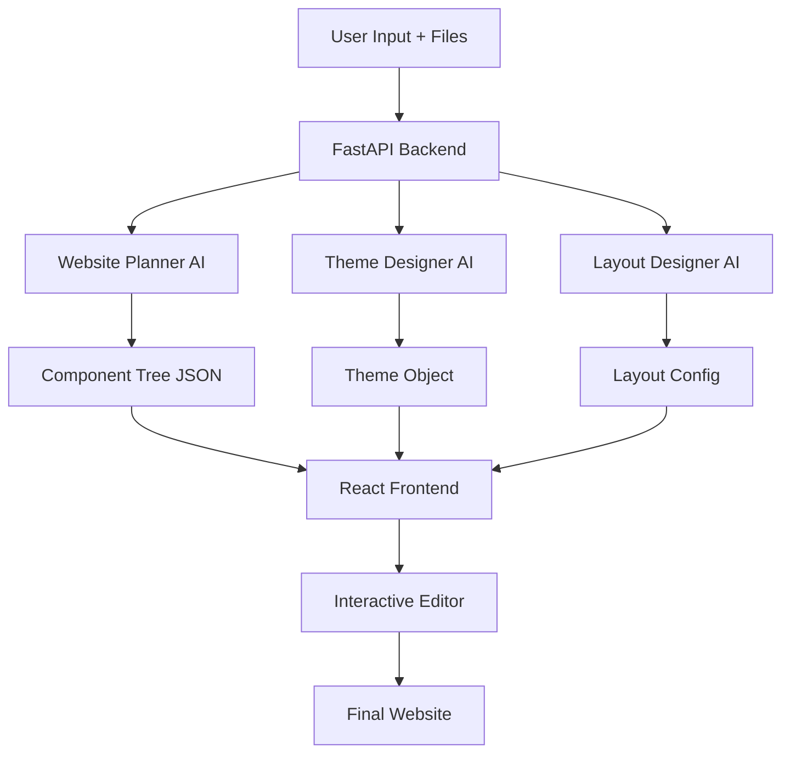

# BuildAndHost Project Analysis

## 🎯 Project Overview

**BuildAndHost** is an AI-powered website builder that generates fully functional, editable websites from natural language descriptions. Users describe what they want, optionally attach files, and the AI creates a complete website with structure, content, styling, and responsive design.

---

## 🏗️ Architecture

### High-Level Flow



### Stack Components

#### Frontend (`ai-website-builder/`)
- **Framework**: React 19 + Vite + TypeScript
- **Styling**: TailwindCSS
- **Routing**: React Router
- **Animation**: Framer Motion
- **Icons**: Lucide React

#### Backend (`Backend/ai/`)
- **API Framework**: FastAPI
- **AI Provider**: Groq API (qwen/qwen3.6-27b model)
- **File Processing**: PyPDF2, python-docx for document parsing
- **CORS**: Configured for localhost:5173

---

## 🔄 Core Workflow

### 1. User Interaction Phase
**Location**: [`home.tsx`](ai-website-builder/src/pages/home.tsx:100)

- User opens chat-like interface
- Describes desired website (e.g., "Create a coffee shop business website")
- Can select website type: Portfolio, Business, Blog, Dashboard
- Can attach files: images, PDFs, DOCX, text files
- Files are displayed as chips with removal option

### 2. AI Generation Phase
**Location**: [`main.py`](Backend/ai/main.py:42)

#### Step 1: File Upload & Processing
- Files saved to `Backend/ai-website-builder/public/uploads/`
- Text extraction from PDFs, DOCX, TXT files
- URLs generated for frontend access (`/uploads/<filename>`)

#### Step 2: Website Planning
**Location**: [`website_planner.py`](Backend/ai/website_planner.py:125)

- AI receives user prompt + file URLs + extracted text
- Generates component tree structure
- Uses only allowed components: Page, Navbar, Hero, Card, Gallery, ContactForm, etc.
- No styling/CSS - only content and structure
- Real images from Unsplash integrated
- Saves to `generated_website.json`

#### Step 3: Layout Design
**Location**: [`layout_designer.py`](Backend/ai/layout_designer.py:48)

- Takes component tree
- Adds responsive breakpoint information
- Provides desktop/tablet/mobile adaptations

#### Step 4: Theme Generation
**Location**: [`theme_designer.py`](Backend/ai/theme_designer.py:148)

- Creates visual theme from content
- Allowed properties: colors, typography, spacing, borders, shadows, transitions
- Supports hover states and media queries
- Safe, sanitized CSS generation

### 3. Editor Phase
**Location**: [`editor.tsx`](ai-website-builder/src/pages/editor.tsx:429)

- Website and theme loaded from localStorage
- Visual drag-and-drop interface
- Three panels:
  - **Palette**: Component library for adding blocks
  - **Canvas**: Live preview with inline selection
  - **Inspector**: Property editor for selected component
- Real-time editing with instant preview
- Auto-save to localStorage
- Contrast checking for accessibility

### 4. Rendering System
**Location**: [`Renderer.tsx`](ai-website-builder/src/renderer/Renderer.tsx:28)

- Recursive component rendering from JSON
- Component registry maps type strings to React components
- Props passed dynamically
- Style objects validated for safety
- Children rendered recursively

---

## 🧩 Component System

### Available Components

| Component | Purpose | Key Props |
|-----------|---------|-----------|
| **Page** | Root container | - |
| **Navbar** | Navigation bar | `items` (array) |
| **Hero** | Landing section | `title`, `subtitle`, `buttonText`, `image` |
| **Section** | Content section | - |
| **Container** | Width wrapper | - |
| **Grid** | Multi-column layout | `columns` (number) |
| **Card** | Content card | `title`, `description`, `image`, `buttonText` |
| **Heading** | Title text | `text`, `level` |
| **Paragraph** | Body text | `text`, `color`, `size`, `align` |
| **Button** | Call-to-action | `text`, `link` |
| **FeatureList** | Feature list | `items` (string array) |
| **Gallery** | Image grid | `images` (URL array) |
| **Stats** | Statistics display | `items` (label/value objects) |
| **FAQ** | Q&A section | `items` (question/answer objects) |
| **Timeline** | Event timeline | `items` (year/title/desc objects) |
| **ContactForm** | Contact form | - |
| **Footer** | Page footer | `copyright` |
| **Image** | Single image | `src`, `alt` |
| **CDNIcon** | SVG icon | `src` (CDN URL) |

### Component Registry
**Location**: [`registry.ts`](ai-website-builder/src/renderer/registry.ts)

Maps component type strings to actual React components for dynamic rendering.

---

## 🎨 Theme System

### Theme Structure
**Location**: [`generatedTheme.ts`](ai-website-builder/src/theme/generatedTheme.ts)

```typescript
{
  theme: {
    name: "Theme Name",
    styles: {
      ".ai-site": {
        backgroundColor: "#...",
        color: "#...",
        fontFamily: "..."
      },
      ".component-button": {
        backgroundColor: "#...",
        transition: "transform 200ms ease"
      },
      ".component-button:hover": {
        transform: "scale(1.03)"
      },
      "@media (max-width: 768px)": {
        ".component-hero": {
          padding: "1rem"
        }
      }
    }
  }
}
```

### Features
- CSS-in-JS conversion
- Hover states
- Responsive breakpoints
- Transitions and transforms
- Sanitized property whitelist
- Contrast checking for accessibility

---

## 🔌 API Endpoints

### POST `/post_prompt`
**Location**: [`main.py`](Backend/ai/main.py:42)

**Request**:
```
FormData:
- prompt: string
- type: string (portfolio/business/blog/dashboard)
- files: File[] (optional)
```

**Response**:
```json
{
  "website": {...},
  "layout": {...},
  "theme": {...},
  "uploads": ["url1", "url2"]
}
```

### POST `/design_layout`
**Location**: [`main.py`](Backend/ai/main.py:119)

**Request**: Component tree JSON
**Response**: Layout configuration

### POST `/design_theme`
**Location**: [`main.py`](Backend/ai/main.py:129)

**Request**: `{ brief: string, website: {...} }`
**Response**: Theme object

---

## 📁 Key Files

### Frontend
- [`App.tsx`](ai-website-builder/src/App.tsx:1) - Router setup
- [`home.tsx`](ai-website-builder/src/pages/home.tsx:100) - Chat interface
- [`editor.tsx`](ai-website-builder/src/pages/editor.tsx:429) - Visual editor
- [`Renderer.tsx`](ai-website-builder/src/renderer/Renderer.tsx:28) - Component renderer
- [`types.ts`](ai-website-builder/src/renderer/types.ts:36) - TypeScript definitions
- [`registry.ts`](ai-website-builder/src/renderer/registry.ts) - Component mapping

### Backend
- [`main.py`](Backend/ai/main.py:1) - FastAPI server
- [`website_planner.py`](Backend/ai/website_planner.py:1) - Structure generation
- [`theme_designer.py`](Backend/ai/theme_designer.py:1) - Visual theming
- [`layout_designer.py`](Backend/ai/layout_designer.py:1) - Responsive layout
- [`groq_api_request.py`](Backend/ai/groq_api_request.py:1) - API examples

### Configuration
- [`package.json`](ai-website-builder/package.json:1) - Frontend dependencies
- [`requirements.txt`](Backend/requirements.txt:1) - Python dependencies
- [`vite.config.ts`](ai-website-builder/vite.config.ts) - Build config
- [`README.md`](README.md:1) - Setup instructions

---

## 🚀 How to Use

### Setup (Quick)

1. **Install Frontend**:
   ```bash
   cd ai-website-builder
   npm install
   ```

2. **Install Backend**:
   ```bash
   cd Backend
   python -m venv .venv
   source .venv/bin/activate  # Linux/Mac
   # or .venv\Scripts\activate on Windows
   pip install -r requirements.txt
   ```

3. **Start Backend** (Terminal 1):
   ```bash
   cd Backend/ai
   uvicorn main:app --reload --port 8000
   ```

4. **Start Frontend** (Terminal 2):
   ```bash
   cd ai-website-builder
   npm run dev
   ```

5. **Open Browser**: `http://localhost:5173`

### Usage Flow

1. **Describe Website**: "Create a photography portfolio with hero, gallery, and contact form"
2. **Upload Assets** (optional): Logo, sample images, brand docs
3. **Click Send**: AI generates website in ~10-15 seconds
4. **Edit in CMS**: Drag/drop components, edit text, adjust properties
5. **Save**: Changes persist in localStorage

---

## ⚠️ Security Concerns

### Critical Issues Found

1. **Exposed API Keys**:
   - Groq API key hardcoded in multiple files
   - Located in: [`website_planner.py`](Backend/ai/website_planner.py:5), [`theme_designer.py`](Backend/ai/theme_designer.py:85), [`layout_designer.py`](Backend/ai/layout_designer.py:7), [`groq_api_request.py`](Backend/ai/groq_api_request.py:28)
   - **Action Required**: Move to environment variables immediately

2. **File Upload Security**:
   - No file type validation beyond extension
   - No file size limits
   - Uploaded files publicly accessible

3. **CORS Configuration**:
   - Only localhost:5173 allowed (good for dev)
   - Needs update for production deployment

### Recommended Fixes

1. Create `.env` file:
   ```
   GROQ_API_KEY=your_key_here
   ```

2. Update Python files to use:
   ```python
   import os
   from dotenv import load_dotenv
   load_dotenv()
   client = Groq(api_key=os.getenv("GROQ_API_KEY"))
   ```

3. Add file validation and size limits in [`main.py`](Backend/ai/main.py:42)

---

## 💡 Strengths

1. ✅ **Clean Architecture**: Separation of concerns (structure → layout → theme)
2. ✅ **Type Safety**: TypeScript on frontend
3. ✅ **AI Streaming**: Uses streaming API for better UX
4. ✅ **Sanitization**: Theme properties are whitelisted for safety
5. ✅ **User Experience**: Polished chat interface with file upload
6. ✅ **Editor UX**: Drag-and-drop, live preview, inline editing
7. ✅ **Accessibility**: Contrast checking, proper alt text
8. ✅ **Responsive**: Mobile-first design approach

---

## 🔧 Technical Decisions

### Why Multi-Stage AI Pipeline?

**Problem**: Single AI call produces inconsistent results mixing structure and styling

**Solution**: Three-stage pipeline
1. **Structure** (website_planner): Content-focused, no visual decisions
2. **Layout** (layout_designer): Responsive breakpoints
3. **Theme** (theme_designer): Visual polish with animations

**Benefit**: More consistent, controllable output

### Why JSON Component Trees?

**Problem**: HTML strings from AI are unsafe and hard to edit

**Solution**: Structured JSON with validated components

**Benefit**: Security, editability, type safety

### Why LocalStorage?

**Problem**: No backend database for MVP

**Solution**: Client-side persistence

**Trade-off**: Single-user, no cloud sync, but simple deployment

---

## 🎯 Current Status

### ✅ Working Features
- AI website generation from prompts
- File upload and processing (images, PDFs, DOCX)
- Real-time chat interface
- Visual drag-and-drop editor
- Property inspector
- Theme generation with hover states
- Responsive design
- Component library
- Auto-save functionality
- Contrast checking

### ⚠️ Known Issues
1. Exposed API keys (security)
2. No user authentication
3. No backend persistence
4. No deployment configuration
5. No error boundaries in React
6. No loading states for theme generation
7. Hard-coded backend URL (localhost:8000)

### 🚧 Missing Features
- Export to HTML/CSS/React code
- Template library
- Version history
- Collaboration features
- Image optimization
- SEO metadata editing
- Custom domain setup
- Hosting integration

---

## 🎓 Learning the Codebase

### Entry Points

1. **Start Here**: [`README.md`](README.md:1) - Setup instructions
2. **User Flow**: [`home.tsx`](ai-website-builder/src/pages/home.tsx:100) - See how users interact
3. **AI Logic**: [`website_planner.py`](Backend/ai/website_planner.py:125) - Understand generation
4. **Rendering**: [`Renderer.tsx`](ai-website-builder/src/renderer/Renderer.tsx:28) - See how JSON becomes UI
5. **Editing**: [`editor.tsx`](ai-website-builder/src/pages/editor.tsx:429) - Explore CMS features

### Code Conventions

- **Frontend**: Functional React components with hooks
- **Backend**: FastAPI with async/await
- **Naming**: camelCase (JS/TS), snake_case (Python)
- **AI Prompts**: Structured system prompts with explicit rules
- **Error Handling**: Try-catch with fallbacks to safe defaults

---

## 📊 Project Metrics

- **Total Files**: ~60
- **Frontend Components**: 20+
- **Backend Endpoints**: 3
- **AI Agents**: 3 (planner, layout, theme)
- **Dependencies**: 
  - Frontend: 18 packages
  - Backend: 25 packages
- **Lines of Code**: ~5,000+
- **Languages**: TypeScript, Python, CSS

---

## 🔮 Next Steps

Based on this analysis, potential improvements:

1. **Security Hardening** (URGENT)
   - Move API keys to environment variables
   - Add file upload validation
   - Implement rate limiting

2. **Production Readiness**
   - Add backend database (PostgreSQL/MongoDB)
   - User authentication (JWT)
   - Environment configuration
   - Docker containerization

3. **Feature Enhancements**
   - Export functionality (HTML/React code)
   - Template marketplace
   - Version control
   - Image optimization

4. **Developer Experience**
   - Error boundaries
   - Loading skeletons
   - Better error messages
   - API documentation (Swagger)

---

## 📝 Summary

**BuildAndHost** is a sophisticated AI website builder with a clean three-stage architecture (structure → layout → theme) that generates editable websites from natural language. The system is functional and demonstrates good separation of concerns, but requires security hardening (especially API key management) before production use. The codebase is well-organized and uses modern tech stack (React 19, FastAPI, Groq AI) with a focus on user experience through chat interfaces and visual editing.

**Current State**: ✅ Functional MVP with security issues  
**Recommended Action**: Fix API key exposure, then deploy or expand features
